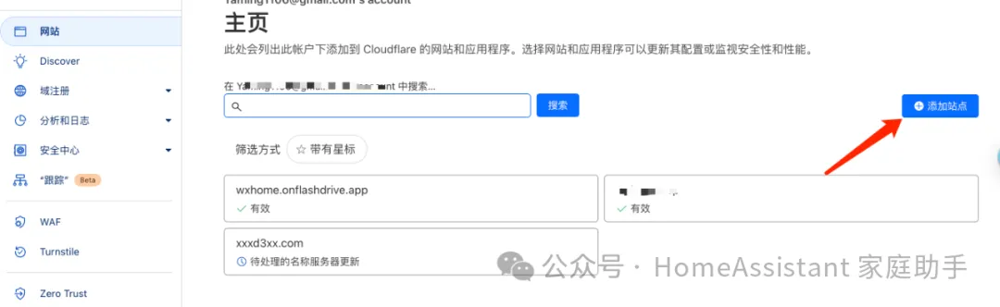

# npm-registry-worker

使用 cloudflare 代理npm registry

## 使用方法

Cloudflare Workers 是一个 serverless 运算平台，能让开发人员使用 V8 引擎的 JavaScript 来编写和部署网站脚本，并且能够在Cloudflare网络中执行这些脚本。

也就是说我们可以使用Cloudflare 来加速访问 registry.npmjs.org, 虽然 Cloudflare 会默认给每个对应的Workers 提供访问域名，但是官方的域名在国内几乎是不能使用了，所以我们需要有一个 托管在 Cloudflare 域名才可以进行后续的操作,自己加速有这么两个条件：

1. 需要一个Cloudflare 账号

2. 需要有一个域名托管在 Cloudflare

### 托管域名  
在Cloudflare dash 中选择网站中的，添加站点：

输入域名
.webp)
拉到底下，选择free（免费版本）
.webp)
点击快速开始，这一步是迁移域名的dns到cf中，如果之前域名在别的服务商那边存在解析记录才会能扫描到。
.webp)
操作到这里就差不多完成了，这时候我们会得到两个`Cloudflare` 分配的name server。    这时候我们就需要去修改我们域名的dns 服务（这个可能各个网站叫的不一样），cf 会每次根据情况分配 **name server（名称服务器），所以要复制你自己的**

.webp)

如果是阿里云，可以按照图盘这里的操作进行修改。
.webp)
.webp)

后面需要等待一段时间，cf验证完域名解析之后会给你的邮箱发送邮件。

### 免费域名

`https://www.l53.net` 可以免费申请1年的二级域名 onflashdrive.app (优惠码 newuser)，可以托管到 CF

注册好域名之后，我们需要修改域名的 `name server`,指向到 cf给我们提供的即可，后续所有的操作都是在 cf完成。

.webp)

### 部署worker
点击 `worker和pages页面`，点击创建应用程序 

.webp)

点击`创建worker`
.webp)

点击部署，代码在`部署之后才可以修改`。
.webp)

点击应用进入详情

.webp)
点击编辑代码，把我提供的woker代码复制进去, `代码在 index.js文件中`

.webp)

这里需要把 `CUSTOM_DOMAIN` 改成你自己的希望的域名，这个域名和后面的自定义域名是一样的，也就是你的加速域名。

例如你有一个域名是： `xxx.com` ,你期望的代理域名是：`npmproxy.xxx.com` ,那这里就是填写：`https://npmproxy.xxx.com`. 修改完成之后`点击部署`

.webp)

在worker 详情，点击设置下面的触发器，点击添加自定义域名，填入刚刚在代码里面写的域名，点击保存然后等待cf给你签发https证书之后即可。

.webp)

访问一下你的域名，出现下面的画面则部署成功了。

然后再把加速地址换成你自己专属地址即可，一天有10万次调用。也可以使用我的加速服务：https://npmproxy.wxhome.onflashdrive.app

.webp)
